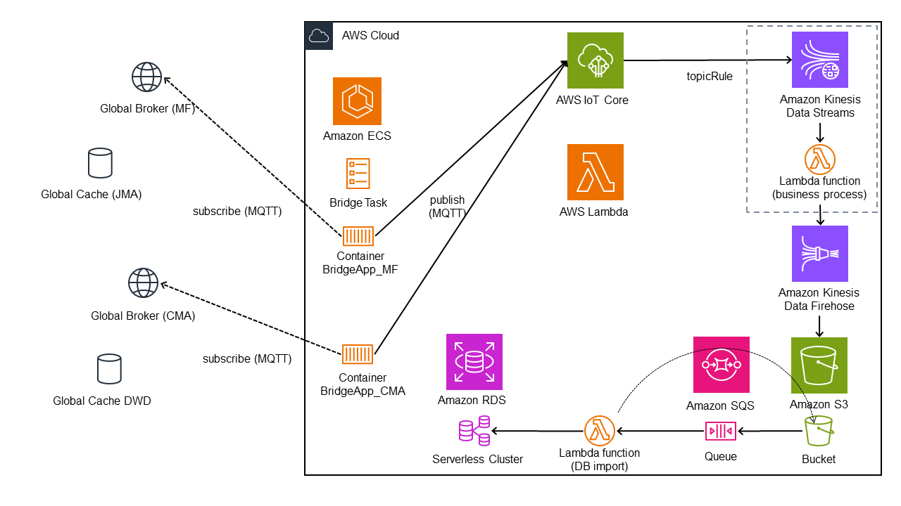
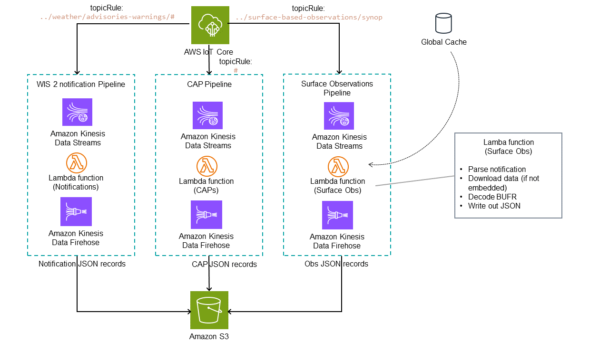

# Amazon Web Services based WIS2 monitoring prototype 
A proof of concept of a WIS2 monitoring system implemented in AWS and using CDK.
The PoC explores how AWS native (serverless) services can be leveraged to implement a flexible and parallel architecture than can process and analyse a variety of different datatypes exchanged in WIS2 at scale.

## WIS2
WIS2 is a system used to exchange a multitude of meteorological data-formats in real-time. It is uses a pub/sub approach, based on the MQTT protocol.
Data is exchanged by making the data available on a web-resource, tyically web-server, and exchanging a notification message on a set of Global Brokers. Users can obtain data of interest by subscribing to the corresponding MQTT topic and using a link embedded in the notification to download data. Global Caches cache core-data by subscribing, downloading data to a local cache and re-publishing a notification referencing the local cache.
Currently in a pilot-phase, around 6 million messages are exchanged through WIS2 on a daily basis. Eventually upwards of 100 million messages may be exchanged in WIS2, bringing to the forefront the question how scalable cloud native design can be used to monitor / process data in WIS2.

## Core architecture considerations
The main considerations in the design of the prototype were scalability, flexiblity and reliability. The approach taken in this project is to leverage services for these purposes.
### scalability
The system must handle upwards of 100 million messages per day. The system is built around AWS Kinesis Data Streams, with Lambda functions doing the heavy-lifting of downloading and processing data. Lambda functions scale well, and Kinesis can group events into batches to reduce both the number of independent Lambda invokations, and files written into S3. Other AWS services used to increase the scalability of the system are Elastic Container Service (ECS), Simple Queue Service (SQS) and Aurora serverless DB clusters.
ECS can can spawn additional containers in case of increased workload, which can be combined with MQTT v5 shared connections to distribute workload. SQS prevents database connection exhaustion in case of bursts and Aurora serverless clusters also spawn additonal resources to horizontally and vertically scale the database.
### flexibility
The system must handle different data-formats, which are not all known at design-time. MQTT topics can be used to select data of interest and routed to Kinesis Data Streams with a data-specific Lambda processing functions. Lambda functions can be based on Docker, a convenient way to include domain-specific libraries to process meteorological formats.
### reliability
The system must monitor data in WIS2 and recover data exchanged during downtime and deal with internal and external error conditions, such as cache downtime, AWS internal processing errors or incorrect/incomplete data. MQTT QoS flags and client IDs can be used to have the external brokers to cache data exchanged during a possible downtime (subject to availability of memory and configuration). Subscribing to multiple Global Brokers provides redundancy at the cost of duplicate messages. Kinesis Data Streams keep records in the stream until all records have been sucesfully acknowledged. SQS keep records in the queue unless processing has been acknowledged, and have Dead Letter Queues to route errouneous data to. SQL transactions make sure data has been written to the database before removing data from the processing chain.

## High-level architecture
Following the data as it flows through the system, the architecture consists of the following components.
 * Bridge. A simple bridge microservice which subscribes to a Global Broker and re-publishes notifications into the AWS IoT core MQTT broker. The bridge is implemented using python using pahoo-mqtt and awsiot.  
 * AWS IoT Core. The gateway for data into the system and for data to be dispatched to the right processing pipeline by using WIS2 the topic hirarchy.
 * Data Processing pipelines. One pipeline per data-type monitored by the system. Data is inserted into a Kinesis Datastream via a MQTT topic rule. Data is then processed by a custom lambda function connected to the stream and which processes/decodes the data as needed. The processed data is written into a AWS Firehose stream, buffered and written out into S3 objects.
 * Database insertion queue. A lambda function reads data from S3 objects in response to S3 object creation events, and bulk-inserts records into the database. SQS queues buffer object creation events to achieve an even level of inserts into the database.
 * Database. Data is written into the database with each processing pipeline having its own database tables. Downstream analytics tools query the database to extract insights. 
 * Monitoring (internal). AWS Cloud Watch on-board and custom metrics monitor the flow of data through the system from bridge, internal broker, processing-pipelines and records written into the database.  

  

## Detailed architecture

### Bridge
Python code subscribing to one or more topics on a Global Broker using paqho-mqtt and re-publishing all WIS2 notifications messages to AWS IoT Core using awsiot. The implementation is a microservice and lightweight. The bridge receives and re-publishes notifications, after lightweight processing. Notification messages are parsed as JSON, and a metadata element with timing information and the original topic is inserted. Since AWS limits the depth of the topic hierarchy, static parts of the WIS2 topic hierarchy are removed and the topic depth limited to 8.
Custom metrics about the number of messages processed are sent to AWS Cloud Watch.
The bridge code is published as a Docker image to AWS ECR and runs as Docker containers in AWS ECS as a Faregate Task once instance per Global Broker with instance specific metadata passed in as environment variables.     

### AWS IoT Core
AWS IoT Core (MQTT) is used to insert messages into the system. IOT Core authenticates connection from the bridge using AWS Signed SSL certificates associated to IoT Things which are authorized to publish. One IoT Core instance per AWS region is available by default. All data is thus available on the internal broker for consumption by the other system components.

### Data processing pipelines
AWS Kinesis Data Streams are the core of the data-processing. One separate Data Stream is instanciated per type of data processed by the system. Kinesis Data Streams can route data from IoT Core with on-board means by suscribing using topic rules. For the PoC, pipelines for Surface BUFR observations, CAP Alerts and processing of all notifications were implemented.
A Lambda function with custom code processes the data by reading batches of data from its Kinesis Data Steam, extracing required data and writing data out as JSON records into a Kinesis Firehose stream. Lambda functions are deployed as Lambda Container images using Docker images, which makes including third party libraries for processing meteorological data easy. An internal library implements common functions, such as downloading data from WIS2 or message validation, which are needed by multiple processing pipelines. As processing a WIS2 record takes around 1 second, including download of data from a Global Cache, Lambda functions need to run in parallel. A combination of number of shards in the Kinesis Data Stream, and Lambda function parallelization is used to achieve a high enough parallelization factor to process all messages in WIS2.  
The Kinesis Firehose Stream, linked to a folder in a S3 bucket, writes out the JSON records in chunks, controlled by the buffer size and buffer window size parameters.

 

### Database insertion queue
Buffered data written into S3 is processed by a Lambda function which parses the data and writes it into the database. Each pipeline has its own JSON format and database table. The S3 foldername is used by the Lambda function to determine which JSON format and database table to use. Write events to S3 are inserted into SQS queues which are processed by the Lambda function. This prevents too many parallel Lambda functions exhausting the database in case of many chunks being written to S3 at the same time. 

### Database
An Aurora MySQL database is used to store processed data and make it available to downstram analytics tools. Each processing pipeline has its own table(s) into which data is inserted. A periodic Lambda job empties the database of records older than a set number of days.

## Development platform
The Amazon Cloud Development Toolkit (CdK) is used to represent the required infrastructure as code and to deploy an instance of the system. SSL certificates used to authenticate IoT Things are created locally with OpenSSL, because they cannot be generated by CdK. They are however managed and unloaded to AWS using CdK.
To manage the database schema are CdK plugin called resource-initializer is used, which creates or updates the database schema based on a schema file. Due to the size of the database, other approaches to schema management need to be used once the system is in operation and has accumulated more than a couple of million rows.

## future extensions
 * shared subscription for bridge: MQTT shared subscriptions could be used to increase the reliablily of the bridge component. For example, the bride could be deployed in multiple availability zones or accounts.
 * auto-scaling of bridge. ECS Fargate could dynamically scale the number of bridge containers. In conjunction with MQTT shared-connections this would allow to dynamicall respond to message increase that goes beyond what a static number of nodes can process.

## discussion
 * Use of IoT Code / MQTT in the system. The ability to source messages from a central broker is nice, but adds significant cost. It is probably better to route data directly into Kinesis Data Streams from the bridges. This removes a costly component at the expense of slighly increased complexity in the bridge logic, which would have to take the decision into which Kinesis stream a message should be routed.

# practical stuff

## installation

 * checkout code
 * provide configuration and secrets in env_secrets.json
 * set default AWS accountId and Region env variables of configure wis2monitoring-stacks.ts
 * `cdk synth; cdk deploy``

## certificates are created locally like this
openssl genrsa -out privatekey.pem 2048
openssl req -new -subj "/O=WMO/CN=AWS IoT Certificate" -key privatekey.pem -out cert.csr

## testing

### CAPs
cdk synth ; sam build -t cdk.out\Wis2MonitoringStack.template.json ; sam local invoke CAPLambda -t cdk.out\Wis2MonitoringStack.template.json -e docker\lambda_swic\test\test_notification.json

### notifications
cdk synth ; sam build -t cdk.out\Wis2MonitoringStack.template.json ; sam local invoke NotificationLambda -t cdk.out\Wis2MonitoringStack.template.json -e docker\lambda_notifications\test\test_notification.json
